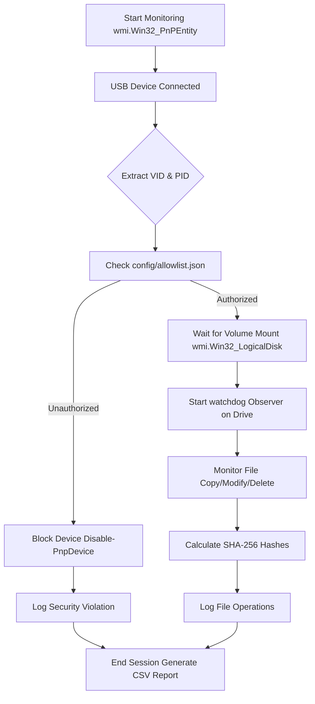

# USB Device Control & Monitoring Framework

## Overview
This project is a Python-based security framework designed to detect, monitor, and restrict unauthorized USB activity on a Windows system. It addresses common physical access threats such as data exfiltration and USB malware by enforcing allowlist policies and tracking file movements.

## Features
- **Real-time USB Detection**: Monitors Windows events for USB plug/unplug activities using WMI.
- **Auto-Blocking**: Restricts access to unauthorized USB devices by disabling them via PowerShell (`Disable-PnpDevice`).
- **Policy Enforcement**: Compares connected USB hardware against a JSON allowlist (`config/allowlist.json`) using Vendor ID and Product ID.
- **File Auditing**: Monitors authorized USB storage devices in real-time, logging file creations, modifications, deletions, and moves.
- **Cryptographic Hashing**: Calculates SHA-256 hashes for all file transfers to ensure integrity and exact tracking.
- **Reporting**: Generates comprehensive CSV security reports summarizing all logged activities and policy violations.

## Prerequisites
- **OS**: Windows (Requires Admin/Elevated privileges for auto-blocking)
- **Python**: 3.x
- **Libraries**: `wmi`, `pywin32`, `watchdog`

## Installation
1. Clone or extract the repository.
2. Create and activate a virtual environment:
   ```cmd
   python -m venv venv
   .\venv\Scripts\activate
   ```
3. Install the required Python packages:
   ```cmd
   pip install wmi pywin32 watchdog
   ```

## Configuration
Edit the `config/allowlist.json` to include your authorized USB devices. You need the Hex `Vendor ID` and `Product ID`.
```json
{
  "approved_devices": [
    {
      "vendor_id": "0x1234",
      "product_id": "0x5678",
      "serial_number": "OptionalSerial",
      "description": "Admin Trusted USB Drive"
    }
  ]
}
```
*Note: You can find the VID and PID of a device by looking at the Windows Device Manager -> Properties -> Details -> Hardware Ids.*

## Usage
Run the script as an Administrator (required for blocking unauthorized devices).

```cmd
python main.py
```

- When an **authorized** device is connected, the framework will begin monitoring its assigned drive letter for file modifications.
- When an **unauthorized** device is connected, it will be automatically disabled, preventing system access.

Logs are stored in `logs/usb_audit.log`.
A summary report is generated in the `logs` directory when the program gracefully exits (Ctrl+C).

## Architecture Flow

